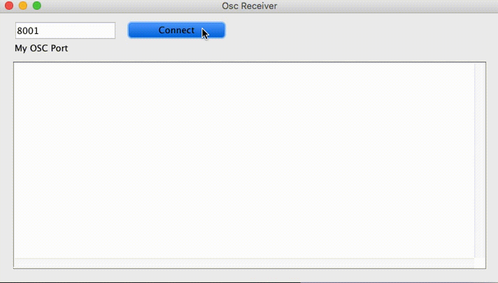

# OscReceiver



OscReceiverは、OSC（Open Sound Control）メッセージの受信とデバッグを行うためのProcessingベースのツールです。複数のポートを同時に監視でき、リアルタイムでOSCメッセージを表示・ログ出力します。

## 主な機能

### マルチポート監視
- 最大3つのOSCポートを同時に監視可能
- 各ポートは独立して接続・切断が可能
- ポート数は動的に追加・削除可能（+/-ボタン）

### リアルタイム表示
- 受信したOSCメッセージをリアルタイムで表示
- 各ポートごとに独立したログエリア
- タイムスタンプ付きのログ表示

### 設定管理
- ウィンドウ位置・サイズの自動保存
- ポート設定の永続化
- OS別の適切な設定ディレクトリを使用

## 使用方法

### 起動
1. Processing IDEで`oscReceiver.pde`を開く
2. 実行する

### ポート設定
1. ポート番号を入力フィールドに入力
2. 「Connect」ボタンをクリックして接続
3. 複数ポートを使用する場合は「+」ボタンでポートを追加

### ログ表示
- 各ポートのログエリアに受信したOSCメッセージが表示されます
- メッセージは以下の形式で表示されます：
  ```
  [yyyy/MM/dd hh:mm:ss.SSS]アドレスパターン: [引数1], [引数2], ...
  ```

## 設定ファイル

### config.json
アプリケーションの設定は`config.json`で管理されます：

```json
{
  "portCount": 3,
  "ports": [8001, 8002, 8003],
  "windowX": 100,
  "windowY": 100,
  "windowWidth": 800,
  "windowHeight": 450
}
```

- `portCount`: 表示するポート数（1-3）
- `ports`: 各ポートの番号
- `windowX`, `windowY`: ウィンドウの位置
- `windowWidth`, `windowHeight`: ウィンドウのサイズ

### 設定ディレクトリ
OS別の適切なディレクトリに設定が保存されます：
- **Windows**: `%APPDATA%\OscReceiver\`
- **macOS**: `~/Library/Application Support/OscReceiver/`
- **Linux**: `~/.config/OscReceiver/`

## 技術仕様

### 依存関係
- Processing 3.x/4.x
- oscP5ライブラリ
- log4j（ログ出力用）

### 対応OS
- Windows
- macOS
- Linux

### ポート仕様
- デフォルトポート: 8091, 8002, 8003
- 最大同時監視ポート数: 3
- データグラムサイズ: 100,000バイト

## ファイル構成

```
src/oscReceiver/
├── oscReceiver.pde          # メインアプリケーション
├── GuiListener.pde          # GUIイベントリスナー
├── OscReceiverConfig.java   # 設定管理クラス
├── SystemConfigManager.java # システム設定管理
├── data/
│   ├── config.json          # 設定ファイル
│   └── log4j.properties     # ログ設定
├── code/
│   ├── oscP5.jar           # OSCライブラリ
│   └── log4j.jar           # ログライブラリ
└── log/                    # ログファイル出力先
```

## ライセンス

MIT License
